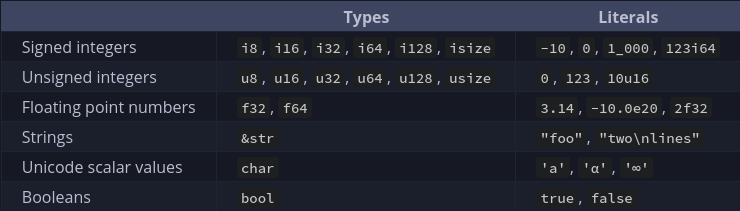
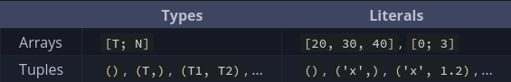

# Day 1

## Index
1. Basic Rust Syntax
2. Memory management
3. Ownership

### 1. Basic Rust Syntax

* Scalar Types

* Compound Types

* `println!`

this is a macro for printing Arrays

* Reference

by using `&`, we could point the reference of the variable

* Slices

by `a[i..j]`, then we get elements from $i \leq x < j$

* String vs str

String: `std::string` in `c`

str: `const char*` in `c`

* Methods

made by `fn`

(When making functions for `struct`, use `impl` in order to connect the function to the struct and don't forget to use `&self` to represent the method is for the connected struct)

!Also, `Rust` don't have function overloading, instead we could use Generics for various datatypes
